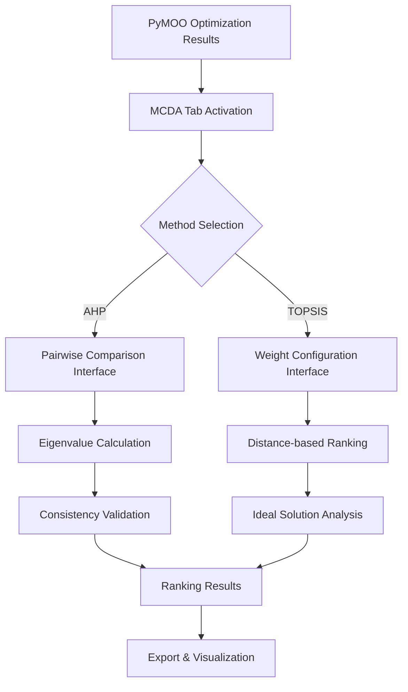

# PyMOO GUI: How the System Works
## Comprehensive Technical Presentation

### 🎯 **Executive Summary**

The PyMOO GUI is a **comprehensive multi-objective optimization platform** built with PyQt6 that integrates advanced optimization algorithms with professional-grade decision analysis capabilities. The system provides an intuitive workflow from problem definition through solution ranking, supporting both individual and collaborative group decision making.

---

## 🏗️ **System Architecture Overview**

### **High-Level Architecture**
```
┌─────────────────────────────────────────────────────────────────┐
│                    PyMOO GUI Application                        │
├─────────────────┬─────────────────┬─────────────────┬───────────┤
│  Authentication │   Core Engine   │   User Interface│   MCDA    │
│     System      │     Layer       │     Layer       │  System   │
├─────────────────┼─────────────────┼─────────────────┼───────────┤
│ • User Login    │ • Problem Mgr   │ • Main Window   │ • AHP     │
│ • Admin Panel   │ • Algorithm Mgr │ • Problem Tab   │ • TOPSIS  │
│ • Multi-User DB │ • Optimizer     │ • Algorithm Tab │ • Group   │
│ • Role Control  │ • Validators    │ • Results Tab   │ • Ranking │
└─────────────────┴─────────────────┴─────────────────┴───────────┘
```

### **Core Technology Stack**
- **GUI Framework**: PyQt6 (Modern, cross-platform interface)
- **Optimization Engine**: PyMOO (Leading multi-objective optimization library)
- **Mathematical Computing**: NumPy (High-performance numerical operations)
- **Data Processing**: Pandas (Structured data handling and export)
- **Visualization**: Matplotlib (Professional-quality plotting)
- **Database**: SQLite (Embedded user management system)

---

## 🔄 **Complete Application Workflow**

### **1. Application Initialization & Authentication**

**Entry Point**: `main.py`
```python
def main():
    # Initialize Qt Application
    app = QApplication(sys.argv)
    
    # Show login dialog for user authentication
    login_dialog = LoginDialog()
    
    # Route to appropriate interface based on user role
    if user_data['role'] == "admin":
        window = MainWindow()  # Full PyMOO GUI
    else:
        user_window = UserInterface()  # Criteria input interface
```

**Key Features**:
- **Multi-user authentication** with role-based access control
- **Admin interface**: Full optimization + decision management capabilities
- **User interface**: Specialized for criteria input in group decisions
- **Database integration**: SQLite for user management and session storage

### **2. Problem Definition Workflow**

**Location**: `ui/problem_tab.py` → `core/problem_manager.py`

**User Interface Process**:
1. **Variable Definition**: Users specify decision variables with:
   - Name, type (Real/Integer/Binary), bounds
   - Custom constraints and validation rules
2. **Objective Function Setup**: Mathematical expressions for optimization goals:
   - Support for complex mathematical functions (trigonometric, exponential, etc.)
   - Real-time syntax validation and security checking
3. **Constraint Specification**: Equality and inequality constraints:
   - Linear and nonlinear mathematical expressions
   - Automatic constraint type conversion for PyMOO compatibility

**Security & Validation System**:
```python
# Multi-layer security validation in utils/validators.py
dangerous_patterns = [
    r'__.*__',      # Prevent dunder method access
    r'import\s+',   # Block import statements  
    r'exec\s*\(',   # Prevent code execution
    r'open\s*\(',   # Block file operations
]

# Sandboxed evaluation with restricted context
result = eval(function, {"__builtins__": {}}, safe_math_context)
```

**Data Flow**:
```
User Input → Real-time Validation → ProblemManager → PyMOO Problem Instance
     ↑                                                        ↓
GUI Feedback ← Security Check ← Expression Parser ← JSON Config
```

### **3. Algorithm Configuration System**

**Location**: `ui/algorithm_tab.py` → `core/algorithm_manager.py`

**Supported Algorithms**:
- **NSGA-II**: Fast non-dominated sorting genetic algorithm
- **NSGA-III**: Reference point-based many-objective optimization
- **SPEA2**: Strength Pareto evolutionary algorithm  
- **MOEA/D**: Multi-objective evolutionary algorithm based on decomposition
- **RVEA**: Reference vector guided evolutionary algorithm

**Dynamic Configuration**:
```python
# Algorithm-specific parameter adaptation
if algorithm_name == "NSGA-III":
    # Automatically configure reference directions
    ref_dirs = get_reference_directions("das-dennis", n_obj, n_partitions=12)
    algorithm = NSGA3(ref_dirs=ref_dirs, pop_size=92)
elif algorithm_name == "NSGA-II":
    algorithm = NSGA2(pop_size=100, eliminate_duplicates=True)
```

**Key Features**:
- **Intelligent parameter suggestions** based on problem characteristics
- **Dynamic UI adaptation** showing relevant options for selected algorithm
- **Real-time validation** with mathematical bounds checking
- **Advanced operator configuration** (crossover, mutation, selection)

### **4. Optimization Execution Engine**

**Location**: `ui/results_tab.py` → `core/optimizer.py`

**Multi-threaded Execution**:
```python
class OptimizationWorker(QThread):
    def run(self):
        # Phase 1: Problem setup (20% progress)
        problem = problem_manager.create_problem_from_config(config)
        
        # Phase 2: Algorithm configuration (40% progress) 
        algorithm = algorithm_manager.create_algorithm(algorithm_config)
        
        # Phase 3: Optimization execution (60-90% progress)
        res = minimize(problem, algorithm, termination, callback=progress_callback)
        
        # Phase 4: Results processing (100% progress)
        processed_results = optimizer.extract_results(problem_config)
        self.results_ready.emit(processed_results)
```

**Real-time Progress Monitoring**:
- **Non-blocking execution**: GUI remains responsive during optimization
- **Generation-by-generation progress**: Live convergence monitoring
- **Cancellation support**: Safe termination at any point
- **Error handling**: Comprehensive exception management with user feedback

### **5. Results Visualization & Analysis**

**Location**: `ui/results_tab.py`

**Comprehensive Result Display**:
- **Pareto Front Visualization**: 2D/3D scatter plots with interactive exploration
- **Convergence Analysis**: Generation-wise metrics and performance indicators
- **Solution Tables**: Sortable, filterable data views with detailed inspection
- **Statistical Analysis**: Built-in metrics (hypervolume, spacing, spread)

**Export Capabilities**:
- **JSON Format**: Complete results with metadata for reproducibility
- **CSV Export**: Tabular data for external analysis tools
- **High-resolution Images**: Publication-ready plots and visualizations

---

## 🎖️ **Multi-Criteria Decision Analysis (MCDA) System**

### **MCDA Architecture Integration**



### **Individual MCDA Process**

**AHP (Analytic Hierarchy Process)**:
1. **Criteria Definition**: Automatic extraction from optimization objectives
2. **Pairwise Comparisons**: Intuitive dropdown interface using Saaty's 1-9 scale
3. **Consistency Checking**: Real-time CR (Consistency Ratio) validation
4. **Weight Calculation**: Eigenvalue method for mathematically rigorous results

```python
# AHP Implementation in core/mcda.py
def calculate_ahp_weights(pairwise_matrix):
    eigenvalues, eigenvectors = np.linalg.eig(pairwise_matrix)
    max_eigenvalue_index = np.argmax(eigenvalues.real)
    principal_eigenvector = eigenvectors[:, max_eigenvalue_index].real
    weights = principal_eigenvector / np.sum(principal_eigenvector)
    
    # Consistency ratio calculation
    CI = (max_eigenvalue - n) / (n - 1)
    CR = CI / random_consistency_index[n]
    
    return weights, CR
```

**TOPSIS (Technique for Order of Preference by Similarity to Ideal Solution)**:
1. **Weight Configuration**: Direct numerical input with normalization
2. **Ideal Solution Calculation**: Automatic determination of positive/negative ideals
3. **Distance Analysis**: Euclidean distance calculations to ideal points
4. **Closeness Ranking**: Final ranking based on relative closeness coefficients

### **🆕 Group Decision Making System**

**Multi-User Collaboration Workflow**:

**Administrator Process**:
1. **Session Creation**: Define group decision problem with rich context
2. **User Coordination**: Monitor participant progress and submission status
3. **Group Analysis**: Execute mathematical aggregation of individual inputs
4. **Results Management**: Export comprehensive reports with consensus rankings

**User Participation Process**:
1. **Session Access**: Join active group decision sessions
2. **Criteria Input**: Provide AHP comparisons or TOPSIS weights
3. **Consistency Validation**: Real-time checking prevents inconsistent submissions
4. **Progress Tracking**: Monitor session status and completion

**Mathematical Aggregation**:
```python
# Group aggregation algorithms in core/group_aggregation.py
def aggregate_ahp_matrices(matrices):
    """Geometric mean aggregation for AHP pairwise comparison matrices"""
    n = matrices[0].shape[0]
    aggregated = np.ones((n, n))
    
    for i in range(n):
        for j in range(n):
            values = [matrix[i, j] for matrix in matrices]
            aggregated[i, j] = np.prod(values) ** (1.0 / len(values))
    
    return aggregated

def aggregate_topsis_weights(weights_dict):
    """Arithmetic mean aggregation for TOPSIS weights"""
    weight_arrays = [np.array(w) for w in weights.values()]
    weights_matrix = np.array(weight_arrays)
    aggregated_weights = np.mean(weights_matrix, axis=0)
    return aggregated_weights / np.sum(aggregated_weights)
```

---

## 🔒 **Security & Validation Framework**

### **Multi-Layer Security Architecture**

**1. Static Analysis Layer**:
- **Pattern Detection**: Regular expressions scan for dangerous constructs
- **Injection Prevention**: Block `import`, `exec`, `eval`, file operations

**2. Sandboxed Execution Layer**:
- **Restricted Environment**: `{"__builtins__": {}}` prevents system access
- **Safe Mathematical Context**: Only approved NumPy functions available

**3. Validation Layer**:
- **Syntax Verification**: Pre-compilation checking for mathematical expressions
- **Type Safety**: Ensure numeric returns from user functions
- **Mathematical Correctness**: Domain validation and error handling

**4. Error Recovery Layer**:
- **Graceful Degradation**: Optimization continues with penalty values on function errors
- **Detailed Feedback**: Specific, actionable error messages for users

---

## 🧵 **Threading & Performance Architecture**

### **Non-Blocking Execution Model**

**Main Thread Responsibilities**:
- GUI responsiveness and user interaction
- Real-time validation and feedback
- Progress display and status updates

**Worker Thread Operations**:
- **OptimizationWorker**: Computation-intensive optimization execution
- **Progress Callbacks**: Regular communication with main thread
- **Result Processing**: Mathematical analysis and data preparation

**Thread Communication**:
```python
# Signal-slot architecture for thread safety
class OptimizationWorker(QThread):
    progress_update = pyqtSignal(int, str)    # Progress percentage & message
    results_ready = pyqtSignal(object)       # Completed optimization results
    error_occurred = pyqtSignal(str)         # Error messages
    
# Main thread connects to worker signals
worker.progress_update.connect(self.update_progress_bar)
worker.results_ready.connect(self.display_results)
worker.error_occurred.connect(self.handle_optimization_error)
```

### **Memory Management & Performance**

**Efficient Data Handling**:
- **Lazy Loading**: Results processed only when needed for display
- **Memory-Conscious Storage**: NumPy arrays for efficient numerical operations
- **Export Optimization**: Pandas for structured data export and analysis

**Scalability Considerations**:
- **Large Solution Sets**: Pagination and filtering for thousands of solutions
- **High-Dimensional Problems**: Adaptive visualization based on objective count
- **Performance Monitoring**: Built-in timing and memory usage tracking

---

## 📊 **Data Flow & State Management**

### **Complete System Data Flow**

```
┌─────────────────┐    ┌─────────────────┐    ┌─────────────────┐
│   User Input    │    │   Validation    │    │   Core Engine   │
│                 │    │    & Security   │    │                 │
├─────────────────┤    ├─────────────────┤    ├─────────────────┤
│ • Problem Spec  │───►│ • Syntax Check  │───►│ • PyMOO Problem │
│ • Algorithm Cfg │    │ • Security Scan │    │ • Algorithm Cfg │
│ • MCDA Inputs   │    │ • Type Validate │    │ • Optimization  │
└─────────────────┘    └─────────────────┘    └─────────────────┘
         ▲                                              ▼
┌─────────────────┐                            ┌─────────────────┐
│   Results UI    │                            │   Results Data  │
│                 │                            │                 │
├─────────────────┤                            ├─────────────────┤
│ • Visualizations│◄───────────────────────────│ • Pareto Front  │
│ • MCDA Rankings │                            │ • Convergence   │
│ • Export Data   │                            │ • Statistics    │
└─────────────────┘                            └─────────────────┘
```

### **Configuration Management**

**Persistent Storage**:
- **JSON Configuration Files**: Human-readable problem and algorithm specifications
- **SQLite Database**: User management, session data, group decision history
- **Export Formats**: Multiple output formats for different analysis tools

**State Synchronization**:
- **Tab Coordination**: Automatic enabling/disabling based on workflow progress
- **Real-time Updates**: Live validation feedback as users modify configurations
- **Session Management**: Persistent storage of work-in-progress configurations

---

## 🎯 **Key Technical Innovations**

### **1. Seamless PyMOO Integration**
- **Direct API Integration**: Native PyMOO problem and algorithm instantiation
- **Mixed Variable Support**: Proper handling of Real, Integer, Binary variable types
- **Constraint Management**: Automatic conversion between GUI and PyMOO constraint formats

### **2. Professional MCDA Implementation**
- **Mathematical Rigor**: Academic-quality AHP and TOPSIS implementations
- **Group Decision Support**: First-class collaborative decision making capabilities
- **Real-time Validation**: Consistency checking prevents mathematical errors

### **3. Advanced Security Framework**
- **Multi-layer Protection**: Static analysis + sandboxed execution + error recovery
- **User Expression Safety**: Safe evaluation of arbitrary mathematical expressions
- **Injection Prevention**: Comprehensive protection against malicious code execution

### **4. Responsive User Experience**
- **Non-blocking Operations**: Multi-threaded execution maintains GUI responsiveness
- **Progressive Disclosure**: Dynamic UI adaptation based on user selections
- **Rich Feedback**: Real-time validation, progress monitoring, and error reporting

---

## 🔧 **Extension & Maintenance Architecture**

### **Modular Design Benefits**
- **Clear Separation of Concerns**: UI, business logic, and data layers are independent
- **Plugin Architecture**: Easy addition of new algorithms and MCDA methods
- **Testing Framework**: Comprehensive unit and integration testing capabilities
- **Documentation Integration**: Extensive inline documentation and architectural guides

### **Future Development Pathways**
- **Algorithm Extensions**: Easy integration of new PyMOO algorithms
- **MCDA Method Expansion**: Framework supports additional decision analysis methods
- **Visualization Enhancements**: Pluggable visualization components
- **Database Scaling**: Architecture supports migration to enterprise databases

---

## 📈 **Production Readiness Status**

### **✅ Complete & Production-Ready**
- **Core Optimization System**: All 5 major algorithms with full parameter control
- **Individual MCDA**: Professional AHP and TOPSIS implementations
- **Group Decision System**: Complete multi-user collaborative workflow
- **Security Framework**: Comprehensive protection against malicious inputs
- **Export & Integration**: Full data export capabilities for external analysis

### **🔄 Current Development Areas**
- **Performance Optimization**: Large-scale problem handling enhancements
- **UI Polish**: Advanced visualization and user experience improvements  
- **Documentation**: Comprehensive user guides and API documentation
- **Testing Coverage**: Expanded automated testing framework

---

## 🎓 **Educational & Research Value**

### **Academic Applications**
- **Multi-objective Optimization Research**: Direct access to state-of-the-art algorithms
- **Decision Analysis Education**: Hands-on experience with professional MCDA methods
- **Collaborative Decision Making**: Real-world group decision support capabilities

### **Industrial Applications**
- **Engineering Design Optimization**: Support for complex engineering problems
- **Business Decision Support**: Professional-grade multi-criteria analysis
- **Operations Research**: Complete toolkit for optimization and decision analysis

---

## 🏆 **Conclusion: System Excellence**

The PyMOO GUI represents a **comprehensive, professional-grade platform** that successfully bridges the gap between advanced optimization research and practical application. Through careful architectural design, robust security implementation, and intuitive user experience, the system provides:

- **Complete Optimization Workflow**: From problem definition to solution ranking
- **Professional MCDA Integration**: Academic-quality decision analysis capabilities  
- **Collaborative Decision Support**: Multi-user group decision making framework
- **Production-Ready Implementation**: Robust, secure, and maintainable codebase
- **Extensible Architecture**: Framework for future enhancements and research

This system demonstrates how sophisticated mathematical algorithms can be made accessible through thoughtful software design, providing both educational value for learning optimization concepts and practical utility for real-world decision making scenarios.